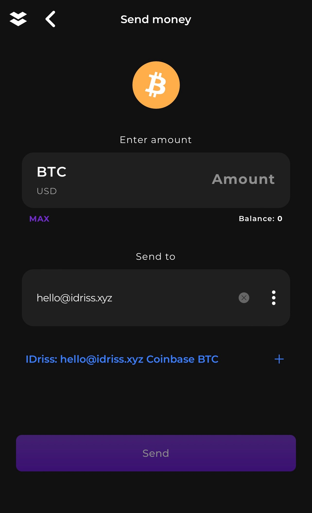
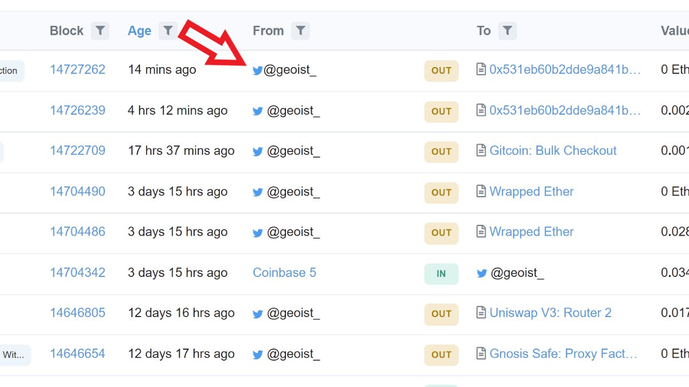

# For Developers

Here are the key benefits of integrating IDriss into your project:

* Improving UX by letting use familiar web2 identifiers in search bars and input fields
* Augmenting UI by replacing wallet addresses with human-readable names
* Linking Twitter usernames, emails, and phone numbers to user profiles in a decentralized manner
* Scaling your app beyond crypto-native userbase

#### **IDriss name support**

Users are able to input IDriss names (emails, phone numbers, and Twitter usernames) in the recipient field and see wallet addresses that have been linked to them. Working examples from within the [Elastos Essentials mobile wallet](https://elastos.info/essentials-the-super-wallet/) and [Tally Ho! Wallet](https://gov.tally.cash/t/tip-2-integration-of-idriss-into-tally-ho-wallet-draft/596) are displayed below.

 .png>)

#### **Onboarding to IDriss inside the wallet**

Users are able to register their IDriss (email, phone number or Twitter username) inside your application. We will perform identity verification for you and allow your users to carry their verified IDriss across protocols. Sign-Ups done through this registration flow are free. A preliminary UI/UX design of the registration flow is presented below:

.png>)

#### Reverse Records

IDriss users can opt-in for reverse records. This allows for translation from wallet address to IDriss. With this functionality, you can give users a more trusted overview of who they interact with in your application. An example of how reverse records could look in an etherscan integration is seen below.

Other benefits of an integration of reverse records are

* Users instantly recognize other user's identity and distinguish it from other data in the dapp's interface.
* Interaction with [@geoist\_](https://twitter.com/geoist\_) instead of a hex address provides more context about the other party. It also adds a way to message them. This is especially good for NFT marketplaces.
* Your Twitter username becomes your portable identity across integrated web3 apps.
* It's easier to find the right people to delegate your votes to on governance platforms like [@SnapshotLabs](https://twitter.com/SnapshotLabs).
* Helps with verifying whether a given address is a real human.
