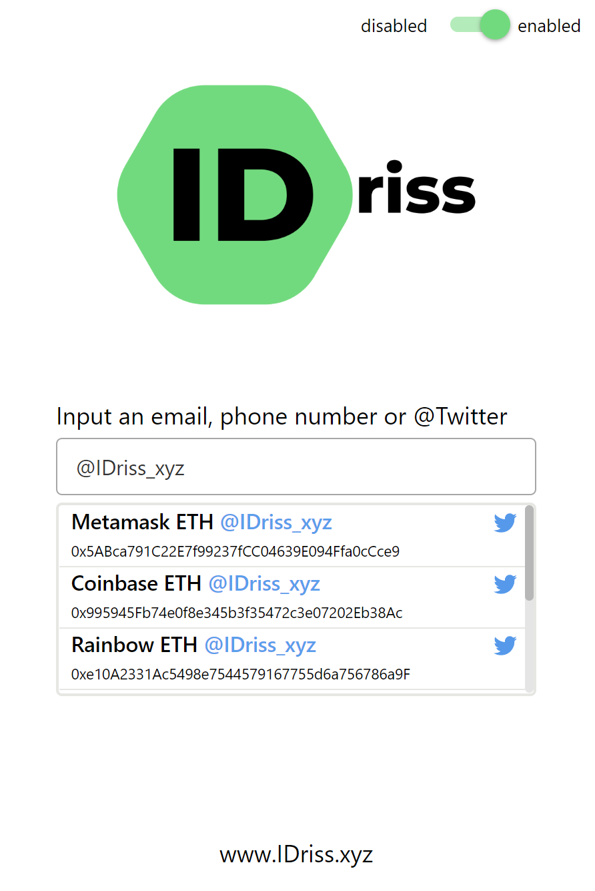

# Browser Extension

Everyone can access the decentralized address book and tipping functionalities through the IDriss browser extension on [Chrome](https://chrome.google.com/webstore/detail/idriss/fghhpjoffbgecjikiipbkpdakfmkbmig), [Firefox](https://addons.mozilla.org/en-US/firefox/addon/idriss-crypto/?utm\_source=addons.mozilla.org\&utm\_medium=referral\&utm\_content=search), or [Edge](https://microsoftedge.microsoft.com/addons/detail/idriss/jgnmbeoapdbocaajhmfjhldhcpngfiol). You can always open the extension on-demand to look up a wallet address, or visit one of the supported websites to interact with IDriss directly.&#x20;


The IDriss plugin sits on top of your browser and resolves emails, phone numbers, and Twitter handles for you. You don't ever have to copy and paste someone's wallet address once it is linked with IDriss.


