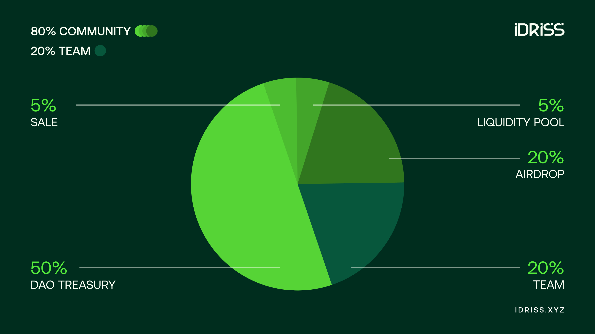

# Tokenomics

[IDRISS](https://basescan.org/token/0x000096630066820566162c94874a776532705231) is the utility and governance token of IDRISS DAO.

* Name/Symbol: IDRISS
* Network: Base + Superchain
* Supply: 1 billion (1B)
* Circulating supply is viewable on [CoinMarketCap](https://coinmarketcap.com/currencies/idriss/)

#### Decentralized Revenue Sharing

Project revenue streams will be distributed through permissionless smart contracts, compensating users and token holders for specific actions they perform. The IDRISS DAO will finalize the details of this decentralized revenue sharing mechanism in Q2 2025.

#### Optimistic Governance

Token holders have voting rights within an Optimistic Governance framework. This model combines startup-like agility with transparency. A core team manages day-to-day operations, while token holders provide decentralized oversight. They trust the team to make routine decisions but retain the power to veto major changes or replace the team if needed. Full community governance launches in early March.

#### Allocations

<figure><figcaption></figcaption></figure>

<table><thead><tr><th width="114">Category</th><th width="111">Percentage</th><th width="525">Description</th></tr></thead><tbody><tr><td>Sale</td><td>5%</td><td>Publicly sold with 100% of the proceeds funding liquidity</td></tr><tr><td>Liquidity</td><td>5%</td><td>Paired with funds raised from the sale to create a trading pair on a decentralized exchange (DEX)</td></tr><tr><td>Airdrop</td><td>20%</td><td>Retroactive airdrop for users who contributed to the ecosystem with  a portion reserved for partner communities</td></tr><tr><td>Team</td><td>20%</td><td>Allocated to the current team, future team members, community contributors, and advisors</td></tr><tr><td>DAO Treasury</td><td>50%</td><td>Reserved for the DAO treasury to fund operations, development, marketing, user incentives, and grants</td></tr></tbody></table>

#### **Vesting**

* Sale & Liquidity: fully liquid at TGE
* Airdrop: exact release mechanism to be announced
* Team: 3-year monthly linear vesting with a 3-month cliff
* DAO Treasury: 3-year monthly linear vesting with a 5% TTS unlock at TGE

