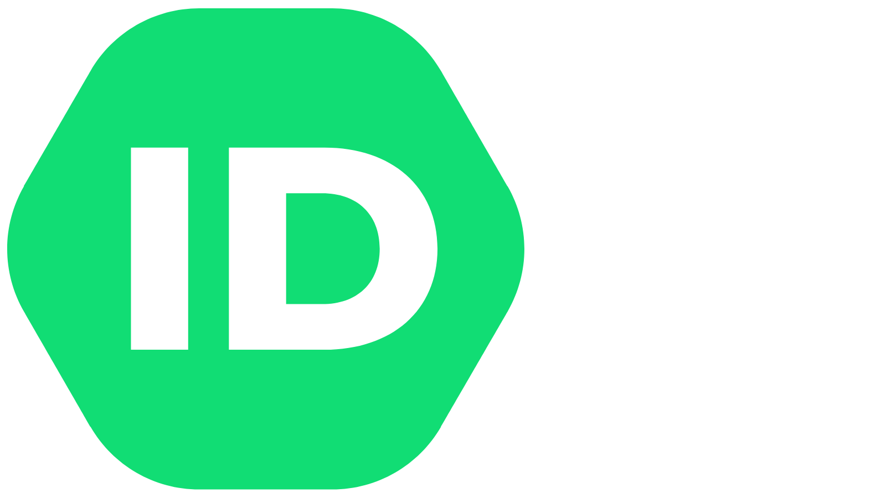
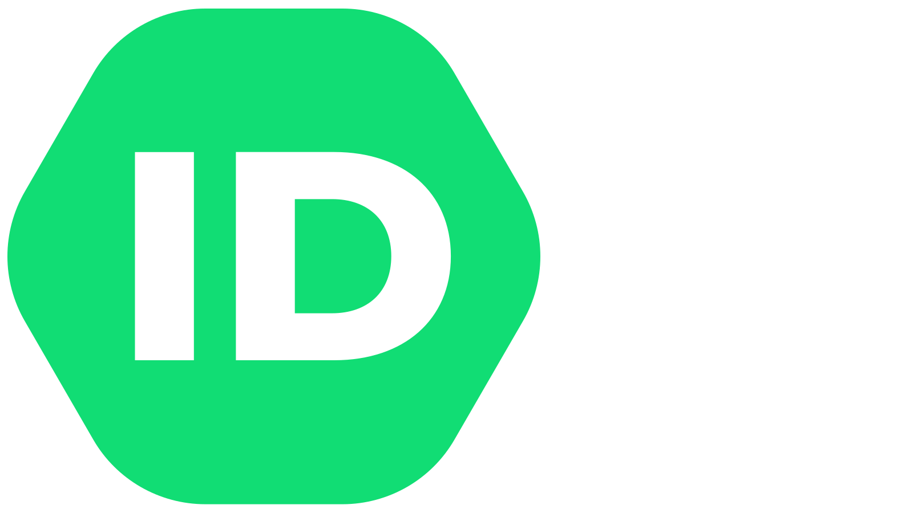
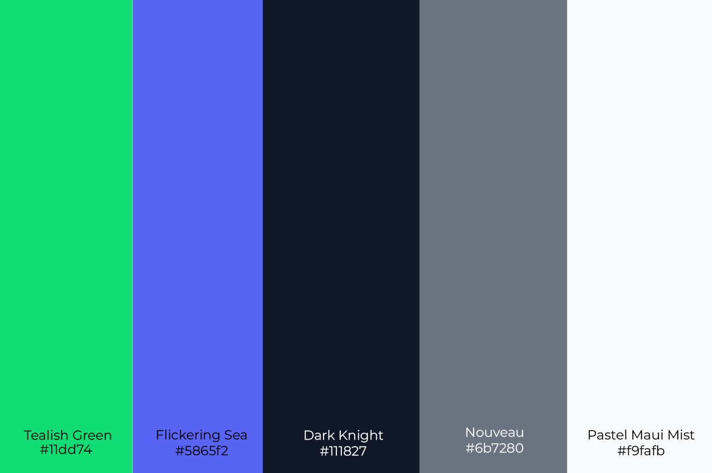

# Brand Resources

## **Download Full Package**



## **Download Single Files**



<table data-view="cards"><thead><tr><th></th><th></th><th data-hidden></th><th data-hidden data-type="files"></th></tr></thead><tbody><tr><td></td><td>Brandmark (PNG)</td><td></td><td></td></tr><tr><td></td><td>Brandmark (SVG)</td><td></td><td></td></tr><tr><td></td><td></td><td></td><td></td></tr><tr><td></td><td>Brandmark White (PNG)</td><td></td><td></td></tr><tr><td></td><td>Brandmark White (SVG)</td><td></td><td></td></tr><tr><td></td><td></td><td></td><td></td></tr></tbody></table>




<table data-view="cards"><thead><tr><th></th><th></th><th data-hidden></th></tr></thead><tbody><tr><td></td><td>Logo (PNG)</td><td></td></tr><tr><td></td><td>Logo (SVG)</td><td></td></tr><tr><td></td><td></td><td></td></tr><tr><td></td><td>Logo White (PNG)</td><td></td></tr><tr><td></td><td>Logo White (SVG)</td><td></td></tr><tr><td></td><td></td><td></td></tr></tbody></table>



<figure><figcaption></figcaption></figure>



