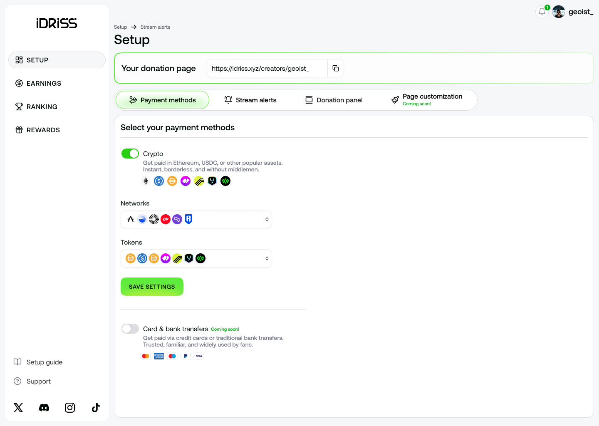

# Creators

<figure><figcaption></figcaption></figure>

Get instant donations in your favorite cryptocurrencies and unlock new ways to grow on Twitch, YouTube, and more.

* Twitch: engage your audience with crypto donations for real-time interactions on your gaming streams and beyond.
* YouTube: monetize both streams and videos with donation links that continue earning even after you go offline.
* Facebook: turn live streams into a new way to interact with your audience onchain.
* More: use it on your personal website or any platform that allows sharing links

Learn more in the [thread](https://x.com/idriss_xyz/status/1864316262811357450).&#x20;

### **Setup guide**

Getting started with the [IDRISS Creators](https://idriss.xyz/creators) is simple. This guide will walk you through the process step by step.

#### Donation page

Your donation page link is displayed at the top of your dashboard. Share this link with viewers to receive donations. To activate your page, continue with the setup below.

<figure><figcaption></figcaption></figure>

#### Payment methods

* Crypto
  * Select the **networks** you want to receive donations on (e.g. Base, Ethereum)
  * Select the **tokens** you want to accept (e.g. IDRISS, USDT)
* _Card & bank transfers via Stripe_ _(coming soon)_&#x20;

<figure><figcaption></figcaption></figure>

#### Stream alerts

Donations can appear as on-screen alerts during your stream. To set them up:

1. Turn on Alerts, Text-to-speech, and AI sound effects

<figure><figcaption></figcaption></figure>

2. Copy the **Overlay link** from your dashboard

<figure><figcaption></figcaption></figure>

3. Open [**OBS Studio**](https://obsproject.com/) or other streaming software
   1. In your active scene, right-click on **Sources** and select **Add**
   2. Choose **Browser** from the list
   3. In the **URL** field, paste the link you copied from the creators app
   4. Set the **Width** and **Height** to match your stream’s resolution (e.g., set to 1920 and 1080 for a 1920x1080 stream)
   5. Click **OK**

<figure><figcaption>
This is what your Browser source settings should look like
</figcaption></figure>

4. Send a test alert through your dashboard. Adjust the size, positioning and volume of the source as needed.

#### Donation panel

Adding a donation panel to your Twitch bio can make it easier for supporters to donate. Here's how to add one:

1. Download a donation banner of your choice
2. Go to your Twitch channel and log in
3. Scroll to your bio and toggle the **Edit Panels** switch on
4. Click the panel with the **“+”** sign to create a new panel
5. Select **Add Image** and upload the banner you downloaded
6. In the **Image Links To** field, paste your donation page link
7. Click **Submit** and toggle the **Edit Panels** switch off

<figure><figcaption></figcaption></figure>

You’re now ready to receive donations. Have questions? Join our [Discord](https://discord.gg/NFWN5dYHsN) for support and troubleshooting.

### FAQ

Where do my donations go?

All funds sent to you are stored in a secure, [self-custodial](https://learn.metamask.io/lessons/what-is-a-self-custody-wallet) wallet linked to your profile. Only you can access it. If you need to use your wallet elsewhere, you can export it from your profile settings.

How do I cash out my crypto?

Withdraw your earnings to a centralized exchange such as Coinbase, Binance, or Kraken to convert crypto to fiat and send it to your bank account.

**Note:** Direct fiat withdrawals from the app aren't available yet, but we're working on adding this in the future.

<strong>Is there a minimum withdrawal amount?</strong>

There's no minimum withdrawal amount. Your funds are always accessible and can be transferred at any time.

Are there any fees on donations?

IDRISS takes a fixed fee of 1% on every donation.

Is logging in with Twitch safe?

We only use your Twitch account to display your channel name and follower count in the app \[CHECK EXACT PERMS]. We can't access your private Twitch data or stream on your behalf.

My donation alerts don't show up on stream. Why?

Double-check that you have copied the Overlay link correctly. Make sure to add the overlay as a new source in your streaming software, and confirm that it isn't hidden behind another source, such as a game capture. If you're not sure whether the overlay is working, use the **Test alert** feature to preview the alert.

