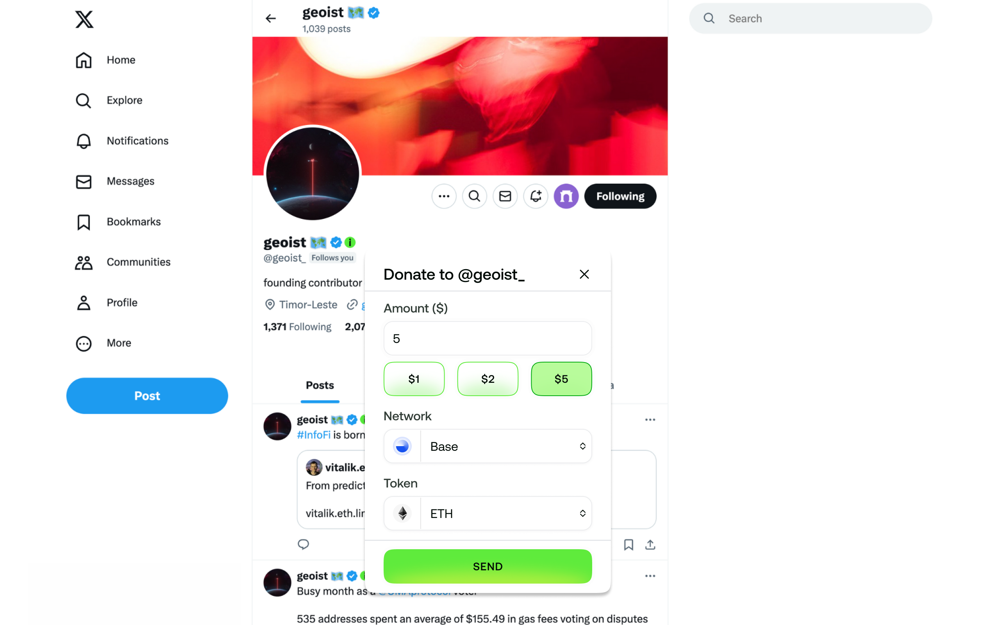
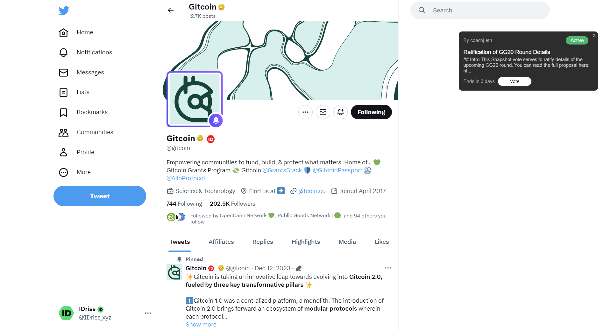
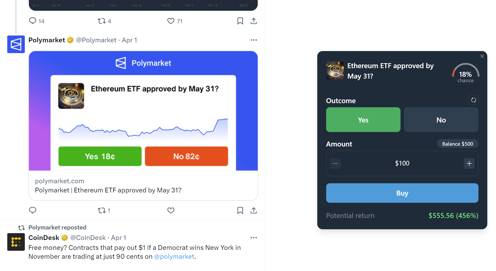

# Extension

<figure><figcaption></figcaption></figure>

Enhance your browsing experience with crypto micropayments, DAO vote alerts, and trading widgets directly in your browser.

* Send and receive crypto on X and Farcaster
* Get alerts for active DAO votes on Agora, Snapshot, and Tally
* Bet on Polymarket directly from your X feed
* Copy onchain moves of your favorite traders

The extension is available for [Chrome, Brave, and Arc](https://chromewebstore.google.com/detail/idriss/fghhpjoffbgecjikiipbkpdakfmkbmig) browsers on desktop. Learn more in the announcement thread [here](https://x.com/idriss_xyz/status/1857374367304568916).&#x20;


The extension is also accessible to mobile Android users through [Kiwi Browser](https://kiwibrowser.com/) and [Mises Browser](https://www.mises.site/).&#x20;


## Features

#### Tipping badges

Twitter profiles registered with IDriss display a green badge next to their names, which can be viewed by turning on the extension.

Hover over the badge to open the payment box, select the amount and network of your choice, and send a payment in a few seconds.

<figure><figcaption></figcaption></figure>


To tip your Twitter friends through the browser extension, you don't need to be registered yourself. It's enough to have the browser extension installed.


#### Governance widget

Get notifications about ongoing DAO votes on [Agora](https://x.com/IDriss_xyz/status/1820803268123189384), [Snapshot](https://snapshot.org/), and [Tally](https://x.com/idriss_xyz/status/1807798872930202007) while scrolling Twitter. Active proposals are displayed within DAO profiles (as depicted below) and on the main Twitter feed (anchored to tweets by DAOs with active proposals).\
\
See the announcement thread [here](https://twitter.com/IDriss_xyz/status/1761049574691819798).

<figure><figcaption></figcaption></figure>

#### Polymarket widget

Trade on the largest decentralized prediction market directly on Twitter. The extension displays trading widgets next to tweets authored by [@Polymarket](https://twitter.com/Polymarket) that show up in your feed. To start using this integration, you have to create an account and deposit balance in the [Polymarket](https://polymarket.com/) app.\
\
See the announcement thread [here](https://twitter.com/IDriss_xyz/status/1780582103396266085). &#x20;

<figure><figcaption></figcaption></figure>

#### Trading copilot

Coming soon.
