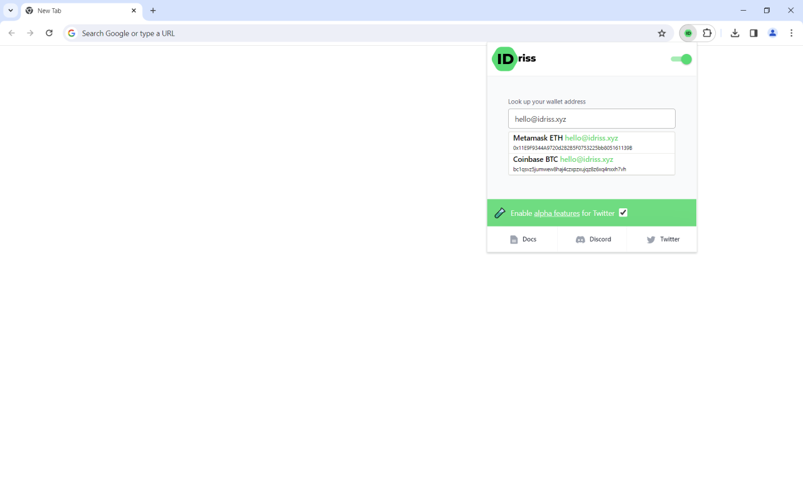

# IDriss Book

## What is IDriss Book?

IDriss Book is a decentralized address book that lets you use a short and familiar identifier like your Twitter name, email, or phone number instead of a wallet address.

## How to Register?

Registration takes less than 60 seconds. Follow this step-by-step registration guide below.




Make sure to use your public wallet address, meaning the one you're fully comfortable being public.


## Browser Extension

To access the address book features you need to install our browser extension on desktop. The extension is available for [Chrome](https://chrome.google.com/webstore/detail/idriss/fghhpjoffbgecjikiipbkpdakfmkbmig), [Firefox](https://addons.mozilla.org/en-US/firefox/addon/idriss-crypto/?utm\_source=addons.mozilla.org\&utm\_medium=referral\&utm\_content=search), and [Edge](https://microsoftedge.microsoft.com/addons/detail/idriss/jgnmbeoapdbocaajhmfjhldhcpngfiol) browser.&#x20;


The extension is also accessible to mobile Android users through [Kiwi Browser](https://kiwibrowser.com/) and [Mises Browser](https://www.mises.site/).&#x20;


## Where Can You Use the Extension?

### 1. Extension Window

At any time you can click on the green ID icon and open the extension window to lookup an IDriss and copy a wallet address to your clipboard.

<figure><figcaption></figcaption></figure>

### 2. Supported Websites

IDriss can also be used on multiple crypto exchanges and websites.

* [etherscan.io](https://etherscan.io/), [polygonscan.com](https://polygonscan.com/), [bscscan.com](https://www.bscscan.com/), and 5 [other](https://twitter.com/IDriss\_xyz/status/1554089644123426818) blockchain explorers
* [binance.com](https://www.binance.com/en), [coinbase.com](https://www.coinbase.com/), [kukoin.com](https://www.kucoin.com/), [kraken.com](https://www.kraken.com/), and 20 other top exchanges
* [poap.xyz](https://poap.xyz/)

<figure><figcaption></figcaption></figure>

### 3. Twitter

Twitter profiles registered with IDriss display a green ID badge next to their names, which can be viewed by turning on the extension &#x20;

Hover over the badge to open the payment box, select the amount and network of your choice, and send a payment in a few seconds. Supported networks include Polygon, Ethereum, BNB Chain, and more coming soon.

<figure><figcaption></figcaption></figure>


To tip your Twitter friends through the browser extension, you don't need to be registered yourself. It's enough to have the browser extension installed.


### Alpha features for Twitter

We're currently experimenting with new features for Twitter. Opt in by clicking a checkbox in the extension window. In the near future, you'll be able to have a granular choice and opt in/out for specific integrations individually.

#### Snapshot

Get notifications about ongoing DAO votes on [Snapshot](https://snapshot.org/) while scrolling Twitter. Active proposals are displayed within DAO profiles (as depicted below) and on the main Twitter feed (anchored to tweets by DAOs with active proposals).

<figure><figcaption></figcaption></figure>

## Partner Integrations

Thanks to the open nature of the protocol, you can also enjoy using your IDriss in third-party decentralized applications.&#x20;

Take a look at these example integrations below. A full list of dApps that integrated IDriss can be found in the [ecosystem.md](ecosystem.md "mention") section.


SyncSwap integration



Questbook integration



Elastos Essentials integration

